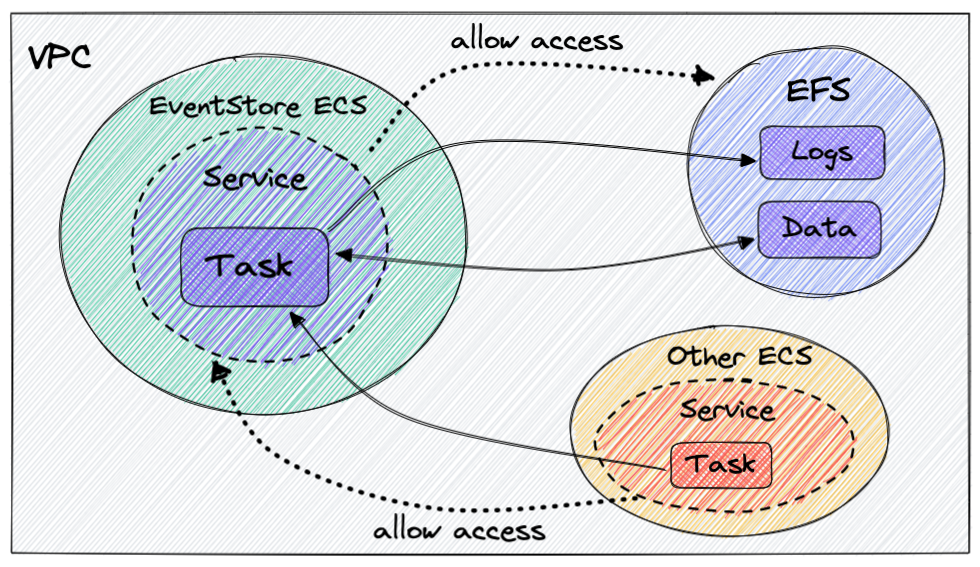

# Setting up EventStoreDB on AWS with CDK

This is a TypeScript CDK project showing how to deploy [`EventStoreDB`](https://www.eventstore.com/) on AWS. The source code is accompanied by a blog post explaining how everything hangs together and reasoning behind the code structure and organization regarding AWS Stacks/Constructs, stateful vs stateless resources and dependencies between resources. Read the full article [here](https://margareta.dev/blog/aws-cdk-event-store/).

## Default commands

- `npm run build` compile typescript to js
- `npm run watch` watch for changes and compile
- `cdk deploy` deploy this stack to your default AWS account/region
- `cdk diff` compare deployed stack with current state
- `cdk synth` emits the synthesized CloudFormation template

## Setup overview

The `CDK` code will:

- create a [VPC](https://aws.amazon.com/vpc/) (Virtual Private Cloud) where the file system will reside,
- create a file system for persisting events,
- spin up a container running `EventStoreDB` on ECS [Fargate](),
- configure security group access to the event store from another `Fargate` service.

Here is the final setup of resources and connections between them:


## CDK best practices

A couple of very important `CDK` [best practices](https://aws.amazon.com/blogs/devops/best-practices-for-developing-cloud-applications-with-aws-cdk/) that we will follow in our setup:

- organize app in logical units that extend `Construct`,
- group constructs into deployment units that extend `Stack`,
- separate stacks with stateful and stateless resources.

Following these will greatly help when the app grows - you will need to refactor or add more resources. For the above setup we will have:

- Constructs:
  - VPC where we will attach the file system and ECS cluster for event store,
  - file system,
  - ECS cluster and `Fargate` service for running event store,
- Stacks:
  - a stateful stack with the VPC and EFS constructs,
  - a stateless stack with the event store construct.

## CDK Infrastructure

EFS is a stateful resource and it depends on VPC (removing it will nuke the EFS), so it makes sense to group these two resources in one stack. The rest - ECS cluster and event store service - belong to a separate stack that can be destroyed and re-deployed without any data loss.

## Creating stacks and dependencies

In the [`bin/app.ts`](/bin/app.ts) we assemble the stacks and constructs taking into account their dependencies. An instance of [`StatefulStack`](/lib/stateful-stack.ts) is created first, the event store stack is created on the fly inside the construct and accepts resources from `StatefulStack` as dependencies in `props`:

```ts
const app = new cdk.App();

const statefulResources = new StatefulStack(app, "StatefulResources");

const eventStoreResources = new EventStoreConstruct(
  new Stack(app, "EventStore"),
  "EventStore",
  {
    fileSystem: statefulResources.fileSystem,
    vpc: statefulResources.vpc,
  }
);
```

## Enable access to event store

Assume we have another `Fargate` service and we want to give it access to our event store. We need to add inbound rules in the event store security group to allow access on specific ports from the security group of this new service.

Ideally we don't want to configure security group rules inside the event store construct/stack because it will invert the dependency arrow - it is not the event store that depends on that external service, but the external service depends on the event store. In this way the deployment cycle of the event store is not affected by deployments of the dependent stacks.

One solution is to allow other `CDK` constructs to configure access to the event store security group that we can expose from the event store construct. The plan is:

- expose `connections` object from the `Fargate` service on the construct,
- pass the `connections` as a dependency in `props` in the other service construct,
- configure access to the service security group via `allowTo`.

## Bonus: generating certificate

To secure communication to/from event store we can generate a certificate with the [certification generation tool](https://developers.eventstore.com/server/v20.10/security.html#certificate-generation-tool) that comes with event store. There is a docker image and a CLI that will generate a certificate authority and a node certificate for `EventStoreDB`, located in a separate `github` repo [`es-gencert-cli`](https://github.com/EventStore/es-gencert-cli).

The full code of the event store construct with certificate generation is [here](/lib/event-store-cert.ts).
